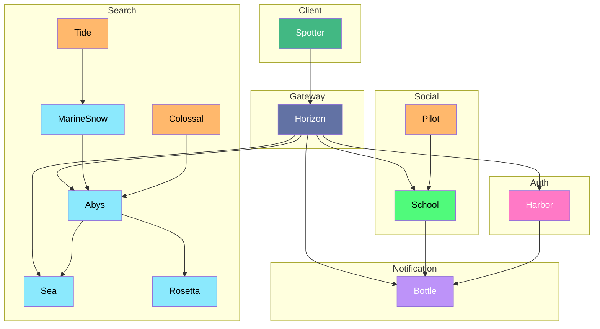

# SEAENCE

## Introduction

| Problèmes | Solutions |
|----------|----------|
| Besoin de connaissance avant de chercher un article | Traduction des données / Refomulation des mots clées afin d'augmenter la pertinence des résultâts |
| Solutions actuelle trop différentes les une des autres | Centralisation et normalisation de la données |
| Manque d'information autour d'une études / accès cette information | Forum / Blog et commentaire |
| Languages de recherches trop différents | Créer un language plus adpaté et confortable (scratch) |

## Features

- [ ] Mise en place d'une authentification SSO (google, microsoft, github)
- [ ] Centralisation et indexationde données des différentes base dans une base vectorielle
- [ ] Traduction / Reformulation des données de recherche
- [ ] Recherche avancées avec création d'un language accessible + application de recherche avec [Embedding](https://en.wikipedia.org/wiki/Embedding)
- [ ] Historique de recherche
- [ ] Pattern de recherche enregistrable et copiable
- [ ] Sauvegarde  et classement d'article (favoris, list)
- [ ] Systeme de warning pour indiquer aux utilisateurs si l'article est correctement indexer (manque de keyword, résumer trop court, manque de source, etc)
- [ ] Forum à la demande afin d'échanger autour d'un article ou d'un sujet

## Infrastructure

| Service | Nom | Description | Technologies | Équipe |
|----------|----------|----------|----------|---------|
| Frontend client | Spotter | application web client | Vue, Vite | @Maubry94 |
| Gateway | Horizon | API Gateway | Duplo | @Vitaalx |
| Backend authentification / User | Harbor | Authentification unique | Duplo, firebase SSO, Postgres | @ZeRiix, @Vitaalx, @Maubry94 |
| Backend elasticSearch | Sea | Base de donnée vectorielle | ElasticSearch, Duplo | @Vitaalx, @ZeRiix, @mathcovax |
| Backend de contenue | Abys | Contient les documents originaux | MongoDB, Duplo | @mathcovax, @ZeRiix |
| Service de scrapping | MarineSnow | Scrapping de donnée | Duplo, WokerThread, SQLLite | @mathcovax, @ZeRiix |
| Frontend contenue (BO) | Colossal | Backoffice | Vue, Vite | @Vitaalx |
| Frontend scrapping (BO) | Tide | Backoffice | Vue, Vite | @ZeRiix |
| Service de forum | School | Service de gestion de forum | Duplo, MongoDB | @Vitaalx |
| Frontend forum (BO) | Pilot | BackOffice | Vue, Vite | @Vitaalx |
| Service de notification | Bottle | | Duplo, MongoDB | @ZeRiix |
| Service de traduction | Rosetta | | Duplo, MongoDB | @ZeRiix |

### Description des services

#### Spotter

Application web client permettant de rechercher des articles, de les lire, de les commenter et de les sauvegarder dans les listes.

#### Horizon

API Gateway serai le seul service directement exposé. Il ne peut etre requeter que par le service Spotter.

#### Harbor

Service d'authentification unique. Il permettra de s'authentifier avec un compte google.
C'est ici que sont stockés les comptes uitilisateurs ainsi que leur données.

#### Sea

Le service ElasticSearch permettra d'indexer les documents avec un certains poids. Il permettra de faire des recherches avancées et de trouver des documents similaires.

#### Abys

Service de stockage de documents. Il contiendra les documents originaux et les données associées. Ce service mettra d'alimenter, structurer et organiser les données. qui servira de source de vérité pour les autres services.

#### MarineSnow

Service de scrapping de donnée. Il permettra de récupérer des données sur le web et de les stocker dans Abys. Il sera capable de scrappé des sites web comme Pubmed, Pedro ou encore ScienceDirect. L'objetif est de faire en sorte que MarineSnow Puisse controller des mini sous service slave dans les thread worker qui seront capable de scrappé des sites web. Il faut faire en sorte qu'il soit le plus générique pour être adapté à n'importe quel site web.

#### Colossal (BO)

BackOffice du service Abys, son but est de gérer le flux d'indexation vers dans Sea.

#### Tide (BO)

BackOffice du service MarineSnow, son but est de gérer le scrapping de donnée.

#### School

Service de forum, il permettra de créer des forums autour d'un article ou d'un sujet à la manière de StackOverflow.

#### Pilot (BO)

BackOffice du service School, son but est de gérer les forums. admin, suppression, etc. (passer l'intégralité des messages en revue par dictionnaire de mots interdit avant leur prévalidation).

#### Bottle

Service de notification, il permettra d'envoyer des notifications aux utilisateurs.

#### Rosetta

Service de traduction, il permettra de traduire les documents dans différentes langues.

## Architecture des services

## Repartition des équipes prévisionnelles

Selon nos premiere estimation, "MarineSnow" et "Abys" sont les services les plus complexes à mettre en place. Il faudra donc une équipe dédiée à ces services. Les autres services sont plus simple à mettre en place et peuvent être géré par effectif réduit.

Les compétences à maitriser pour ces services sont les suivantes:

- Les [workers thread](https://nodejs.org/api/worker_threads.html)
- Les [Regex](https://www.regextester.com/)
- Les requêtes [MongoDB](https://docs.mongodb.com/manual/reference/method/)
- La logique et l'algorithmie
