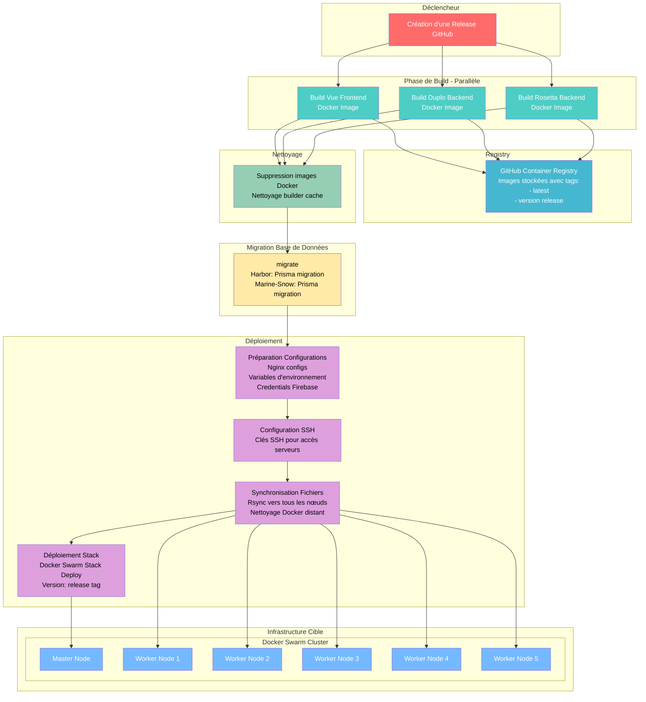

# Documentation de déploiement Seaence

Ce guide explique comment déployer chaque service du projet Seaence en production. Les bases de données sont hébergées en dehors du cluster Docker Swarm.

## Points généraux
- **Bases de données** : Les URLs de connexion pointent vers des bases externes, à configurer selon votre infrastructure. Avant de se lancer, chaque service teste une connexion à ses différentes bases ; il est donc obligatoire que les bases soient disponibles.
- **Variables d'environnement** : Chaque service nécessite des variables spécifiques, à renseigner dans les fichiers `.env.local` montés dans les containers.
- **Pas de SSL** : Les services n'exposent pas de certificat, Cloudflare gère la couche HTTPS.

---

## Services et variables d'environnement

### spotter (Front Vue)
- **Fichier env** : `spotter.env.local`
- **Variables à définir** :
  - `VITE_HORIZON_ENTRYPOINT_BASE_URL` : URL du backend Horizon
  - `VITE_SPOTTER_GLITCHTIP_DSN` : DSN pour Glitchtip (monitoring)
  - `VITE_ENVIRONEMENT` : Environnement (ex: DEV, PROD)

### horizon (Backend Duplo)
- **Fichier env** : `horizon.env.local`
- **Variables à définir** :
  - `ENVIROMENT` : Environnement (ex: DEV, PROD)
  - `HOST` : Adresse d'écoute du service
  - `PORT` : Port d'écoute
  - `CORS_ALLOW_ORIGIN` : Origine CORS
  - `HARBOR_BASE_URL` : URL du service Harbor
  - `SCHOOL_BASE_URL` : URL du service School
  - `ABYS_BASE_URL` : URL du service Abys
  - `SEA_BASE_URL` : URL du service Sea
  - `BOTLLE_BASE_URL` : URL du service Bottle
  - `BEACON_BASE_URL` : URL du service Beacon
  - `CORAL_BASE_URL` : URL du service Coral
  - `GLITCHTIP_DSN` : DSN pour Glitchtip

### sea (Backend Duplo)
- **Fichier env** : `sea.env.local`
- **Variables à définir** :
  - `ENVIROMENT` : Environnement (ex: DEV, PROD)
  - `HOST` : Adresse d'écoute du service
  - `PORT` : Port d'écoute
  - `ES_HOST`, `ES_PORT`, `ES_BASE_URL` : Configuration Elasticsearch
  - `DB_CONNECTION` : Activer la connexion DB
  - `GLITCHTIP_DSN` : DSN pour Glitchtip

### abys (Backend Duplo)
- **Fichier env** : `abys.env.local`
- **Variables à définir** :
  - `ENVIROMENT`, `HOST`, `PORT` : Paramètres généraux
  - `MONGO_INITDB_ROOT_USERNAME`, `MONGO_INITDB_ROOT_PASSWORD`, `MONGO_HOST`, `MONGO_PORT`, `MONGO_DB`, `MONGO_DATABASE_URL` : Connexion Mongo externe
  - `DB_CONNECTION` : Activer la connexion DB
  - `SEA_BASE_URL`, `ROSETTA_BASE_URL` : URLs des services Sea et Rosetta
  - `GLITCHTIP_DSN` : DSN pour Glitchtip

### coral (Backend Duplo)
- **Fichier env** : `coral.env.local`
- **Variables à définir** :
  - `ENVIROMENT`, `HOST`, `PORT` : Paramètres généraux
  - `MONGO_INITDB_ROOT_USERNAME`, `MONGO_INITDB_ROOT_PASSWORD`, `MONGO_HOST`, `MONGO_PORT`, `MONGO_DB`, `MONGO_DATABASE_URL` : Connexion Mongo externe
  - `DB_CONNECTION` : Activer la connexion DB
  - `ASYNC_MESSAGE_MONGO_URL` : URL Mongo pour messages asynchrones
  - `GLITCHTIP_DSN` : DSN pour Glitchtip

### beacon (Backend Duplo)
- **Fichier env** : `beacon.env.local`
- **Variables à définir** :
  - `ENVIROMENT`, `HOST`, `PORT` : Paramètres généraux
  - `MONGO_INITDB_ROOT_USERNAME`, `MONGO_INITDB_ROOT_PASSWORD`, `MONGO_HOST`, `MONGO_PORT`, `MONGO_DB`, `MONGO_DATABASE_URL` : Connexion Mongo externe
  - `DB_CONNECTION` : Activer la connexion DB
  - `ABYS_BASE_URL` : URL du service Abys
  - `GLITCHTIP_DSN` : DSN pour Glitchtip

### bottle (Backend Duplo)
- **Fichier env** : `bottle.env.local`
- **Variables à définir** :
  - `ENVIROMENT`, `HOST`, `PORT` : Paramètres généraux
  - `MONGO_INITDB_ROOT_USERNAME`, `MONGO_INITDB_ROOT_PASSWORD`, `MONGO_HOST`, `MONGO_PORT`, `MONGO_DB`, `MONGO_DATABASE_URL` : Connexion Mongo externe
  - `DB_CONNECTION` : Activer la connexion DB
  - `NO_REPLY_EMAIL`, `SUPPORT_EMAIL`, `CONTACT_EMAIL` : Emails de contact
  - `BREVO_USER`, `BREVO_KEY` : Credentials Brevo
  - `GLITCHTIP_DSN` : DSN pour Glitchtip
  - `ASYNC_MESSAGE_MONGO_URL` : URL Mongo pour messages asynchrones

### bridge (Backend Duplo)
- **Fichier env** : `bridge.env.local`
- **Variables à définir** :
  - `ENVIROMENT` : Environnement (ex: DEV, PROD)
  - `HOST` : Adresse d'écoute du service
  - `PORT` : Port d'écoute
  - `CORS_ALLOW_ORIGIN` : Origine CORS
  - `BEACON_BASE_URL` : URL du service Beacon
  - `ABYS_BASE_URL` : URL du service Abys
  - `SCHOOL_BASE_URL` : URL du service School
  - `GLITCHTIP_DSN` : DSN pour Glitchtip

### harbor (Backend Duplo)
- **Fichier env** : `harbor.env.local`
- **Variables à définir** :
  - `ENVIROMENT`, `HOST`, `PORT` : Paramètres généraux
  - `POSTGRES_HOST`, `POSTGRES_PORT`, `POSTGRES_DB`, `POSTGRES_USER`, `POSTGRES_PASSWORD`, `POSTGRES_DATABASE_URL` : Connexion à la base Postgres externe
  - `FIREBASE_CREDENTIAL_PATH` : Chemin vers les credentials Firebase (le fichier est indispensable au lancement du service)
  - `BOTTLE_BASE_URL` : URL du service Bottle
  - `JWT_KEY`, `JWT_TIME`, `USER_DELETE_ID_KEY` : Sécurité JWT
  - `DB_CONNECTION` : Activer la connexion DB
  - `ASYNC_MESSAGE_MONGO_URL` : URL Mongo pour messages asynchrones
  - `GLITCHTIP_DSN` : DSN pour Glitchtip

### school (Backend Duplo)
- **Fichier env** : `school.env.local`
- **Variables à définir** :
  - `ENVIROMENT`, `HOST`, `PORT` : Paramètres généraux
  - `MONGO_INITDB_ROOT_USERNAME`, `MONGO_INITDB_ROOT_PASSWORD`, `MONGO_HOST`, `MONGO_PORT`, `MONGO_DB`, `MONGO_DATABASE_URL` : Connexion Mongo externe
  - `DB_CONNECTION` : Activer la connexion DB
  - `ASYNC_MESSAGE_MONGO_URL` : URL Mongo pour messages asynchrones
  - `GLITCHTIP_DSN` : DSN pour Glitchtip
  - `BOTTLE_BASE_URL`, `HARBOR_BASE_URL` : URLs des services Bottle et Harbor

### marine-snow (Backend Duplo)
- **Fichier env** : `marine-snow.env.local`
- **Variables à définir** :
  - `ENVIROMENT`, `HOST`, `PORT` : Paramètres généraux
  - `POSTGRES_HOST`, `POSTGRES_PORT`, `POSTGRES_DB`, `POSTGRES_USER`, `POSTGRES_PASSWORD`, `POSTGRES_DATABASE_URL` : Connexion Postgres externe
  - `PUBMED_API_KEY`, `PUBMED_BASE_URL` : Accès PubMed
  - `ABYS_BASE_URL` : URL du service Abys
  - `DB_CONNECTION` : Activer la connexion DB
  - `GLITCHTIP_DSN` : DSN pour Glitchtip

### lighthouse (Front Vue)
- **Fichier env** : `lighthouse.env.local`
- **Variables à définir** :
  - `VITE_BRIDGE_ENTRYPOINT_BASE_URL` : URL du backend Bridge
  - `VITE_LIGHTHOUSE_GLITCHTIP_DSN` : DSN pour Glitchtip
  - `VITE_ENVIRONEMENT` : Environnement
  - `VITE_SPOTTER_BASE_URL` : URL du service Spotter

### rosetta (Backend Duplo)
- **Fichier env** : `rosetta.env.local`
- **Variables à définir** :
  - `ENVIROMENT`, `HOST`, `PORT` : Paramètres généraux
  - `DB_CONNECTION` : Activer la connexion DB
  - `LIBRETRANSLATE_BASE_URL` : URL du service LibreTranslate
  - `GLITCHTIP_DSN` : DSN pour Glitchtip

---

## Déploiement

1. Préparer les fichiers `.env.local` pour chaque service, en renseignant les variables listées ci-dessus.
2. Monter ces fichiers dans les containers via les volumes définis dans `compose.prod.yml`.
3. Vérifier la connectivité aux bases de données externes (MongoDB, PostgreSQL, Elasticsearch, etc.).
4. Lancer le cluster Docker Swarm avec :
```bash
TAG=<image_tag> docker stack deploy -c compose.prod.yml <stack_name>
```

## Schéma du flow


