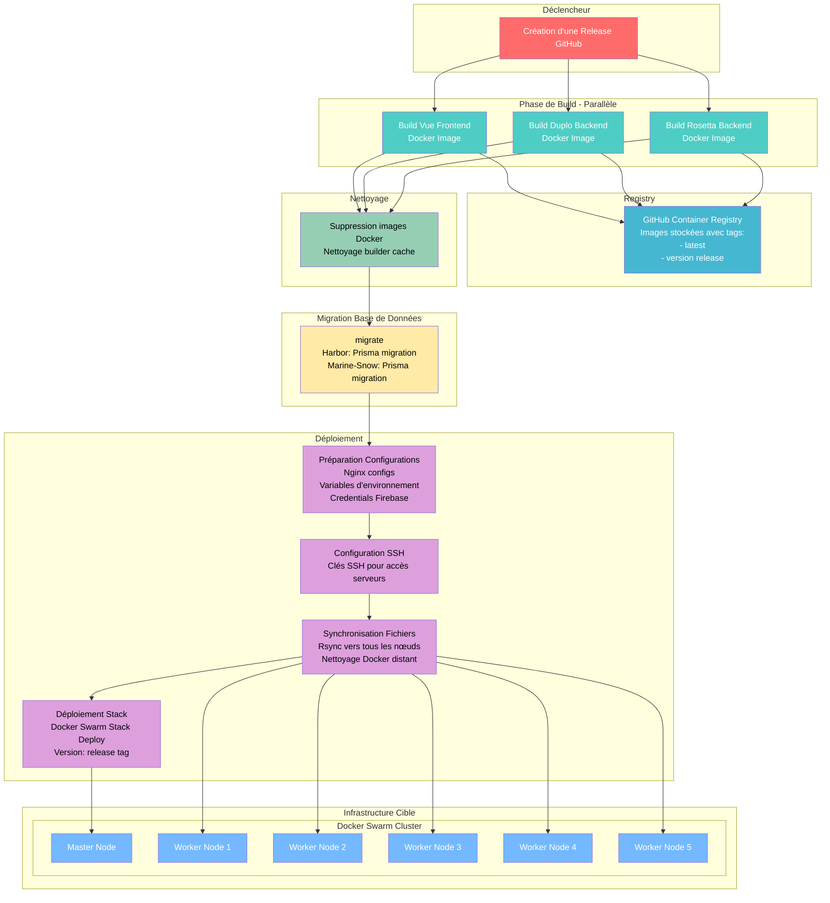

# Infrastructure

---

## Flow

```mermaid
flowchart TB
    subgraph Trigger[Déclencheur]
        Release[Création d'une Release GitHub]
    end

    subgraph Build[Phase de Build - Parallèle]
        VueFront[Build Vue Frontend<br/>Docker Image]
        DuploBack[Build Duplo Backend<br/>Docker Image]
        RosettaBack[Build Rosetta Backend<br/>Docker Image]
    end

    subgraph Registry[Registry]
        GHCR[GitHub Container Registry<br/>Images stockées avec tags:<br/>- latest<br/>- version release]
    end

    subgraph Cleanup[Nettoyage]
        ClearCache[Suppression images Docker<br/>Nettoyage builder cache]
    end

    subgraph Database[Migration Base de Données]
        Migrate[migrate<br/>Harbor: Prisma migration<br/>Marine-Snow: Prisma migration]
    end

    subgraph Deploy[Déploiement]
        PrepareConfigs[Préparation Configurations<br/>Nginx configs<br/>Variables d'environnement<br/>Credentials Firebase]
        SetupSSH[Configuration SSH<br/>Clés SSH pour accès serveurs]
        SyncFiles[Synchronisation Fichiers<br/>Rsync vers tous les nœuds<br/>Nettoyage Docker distant]
        StackDeploy[Déploiement Stack<br/>Docker Swarm Stack Deploy<br/>Version: release tag]
    end

    subgraph Infrastructure[Infrastructure Cible]
        subgraph SwarmCluster[Docker Swarm Cluster]
            Master[Master Node]
            Worker1[Worker Node 1]
            Worker2[Worker Node 2]
            Worker3[Worker Node 3]
            Worker4[Worker Node 4]
            Worker5[Worker Node 5]
        end
    end

    %% Flux principal
    Release --> VueFront
    Release --> DuploBack
    Release --> RosettaBack

    VueFront --> GHCR
    DuploBack --> GHCR
    RosettaBack --> GHCR

    VueFront --> ClearCache
    DuploBack --> ClearCache
    RosettaBack --> ClearCache

    ClearCache --> Migrate
    Migrate --> PrepareConfigs
    PrepareConfigs --> SetupSSH
    SetupSSH --> SyncFiles
    SyncFiles --> StackDeploy

    StackDeploy --> Master
    SyncFiles --> Worker1
    SyncFiles --> Worker2
    SyncFiles --> Worker3
    SyncFiles --> Worker4
    SyncFiles --> Worker5

    %% Styles
    classDef triggerStyle fill:#ff6b6b,color:white
    classDef buildStyle fill:#4ecdc4,color:white
    classDef registryStyle fill:#45b7d1,color:white
    classDef cleanupStyle fill:#96ceb4,color:black
    classDef dbStyle fill:#ffeaa7,color:black
    classDef deployStyle fill:#dda0dd,color:black
    classDef infraStyle fill:#74b9ff,color:white

    %% Application des styles
    class Release triggerStyle
    class VueFront,DuploBack,RosettaBack buildStyle
    class GHCR registryStyle
    class ClearCache cleanupStyle
    class Migrate dbStyle
    class PrepareConfigs,SetupSSH,SyncFiles,StackDeploy deployStyle
    class Master,Worker1,Worker2,Worker3,Worker4,Worker5 infraStyle
```