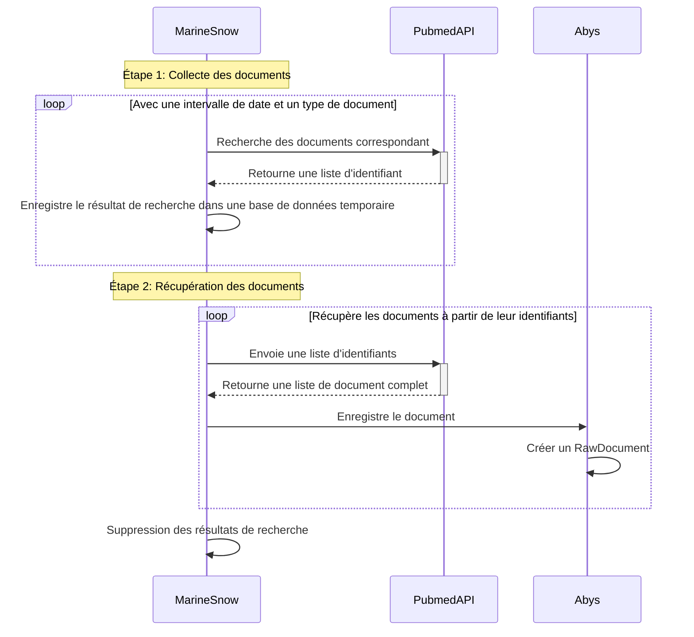

# Feat: Scrapper de la données sur Pubmed

## Schema

```mermaid
sequenceDiagram
	participant MarineSnow
    participant PubmedAPI
    participant Abys


	Note over MarineSnow: Étape 1: Collecte des documents

	loop Avec une intervalle de date et un type de document
		MarineSnow ->>+ PubmedAPI: Recherche des documents correspondant
		PubmedAPI -->>- MarineSnow: Retourne une liste d'identifiant
		MarineSnow ->> MarineSnow: Enregistre le résultat de recherche dans une base de données temporaire
	end

	Note over MarineSnow: Étape 2: Récupération des documents

	loop Récupère les documents à partir de leur identifiants
		MarineSnow ->>+ PubmedAPI: Envoie une liste d'identifiants
		PubmedAPI -->>- MarineSnow: Retourne une liste de document complet
		MarineSnow ->> Abys: Enregistre le document
		Abys ->> Abys : Créer un RawDocument
	end

	MarineSnow ->> MarineSnow: Suppression des résultats de recherche
```