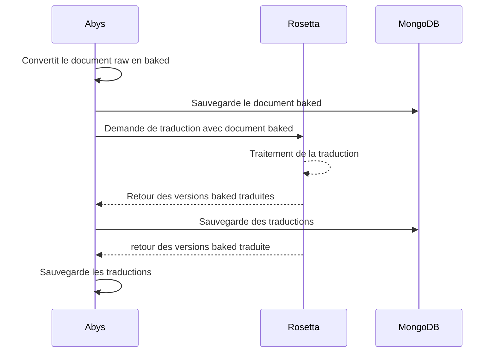

# 📄 Format de document Baked – Documentation

- [Issue 23](https://github.com/mathcovax/seaence/issues/23)

## ✅ Objectifs atteints

- Mise en place d’un format de données **baked** uniformisé
- Schéma TypeScript de la sortie API de **Rosetta**
- Usecase de transformation `raw -> baked`
- Modèle MongoDB pour les documents baked
- Intégration d’un provider **Rosetta** dans **Abys**

## 🚧 Pour tester

[commands](./commands.md) : `npm run docker:abys:document:cookRawDocument -- -q 10 -l fr-FR`
