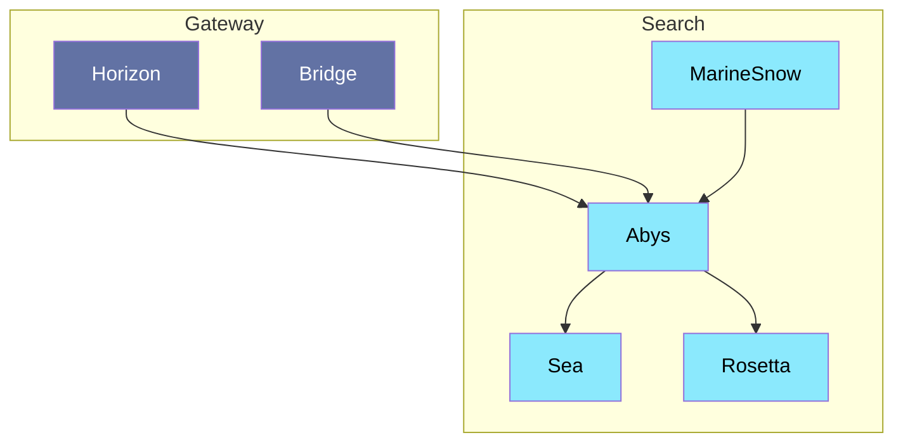

# Abys

---

Service de stockage de documents. Il contiendra les documents originaux et les données associées. Ce service mettra d'alimenter, structurer et organiser les données. qui servira de source de vérité pour les autres services.

## Interaction

> [!NOTE]
> **Horizon** appelle **Abys** pour récupérer les documents.\
> **Bridge** appelle **Abys** pour chercher des documents.\
> **MarineSnow** appelle **Abys** pour indexer les documents crus.\
> **Abys** appelle **Sea** pour indexer des documents.\
> **Abys** appelle **Rosetta** pour traduire des documents.

## Composition

- **Database:** MongoDB
- **Interface:** HTTP

## Technologie

- Duplo