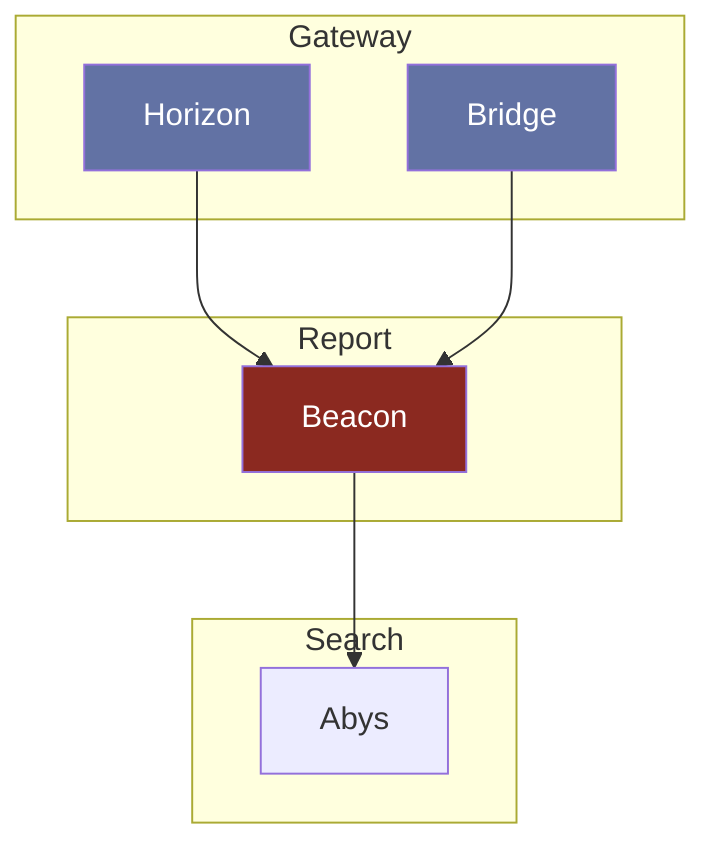

# Beacon

---

Service de gestion des reports d'erreur de traduction. Il permettra de gerer toutes les erreurs liées aux potentiels erreurs de traduction depuis le BO.

## Interaction

> [!NOTE]
> **Horizon** appelle **Beacon** pour créer des signalements sur la traduction d'un document.\
> **Bridge** appelle **Beacon** pour modérer les signalements sur la traduction d'un document.\
> **Beacon** appelle **Abys** pour traiter la re-traduction d'un document.

## Composition

- **Database:** MongoDB
- **Interface:** HTTP

## Technologie

- Duplo