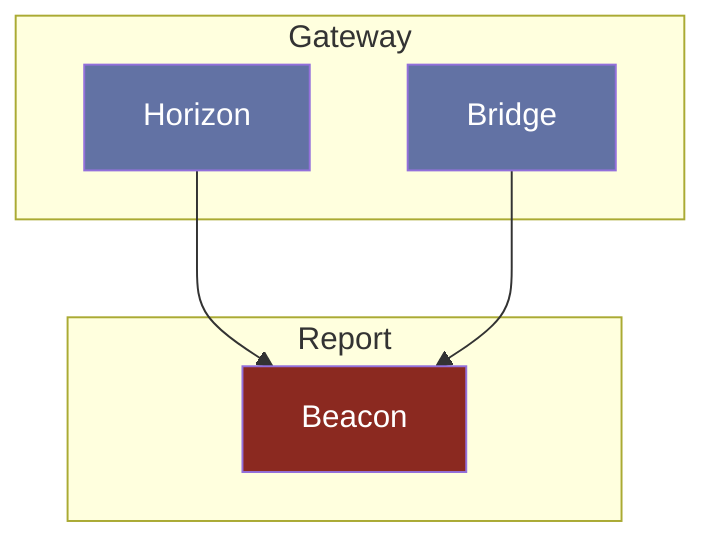

# Beacon

## Interaction

> [!NOTE]
> **Horizon** appelle **Beacon** pour créer des signalements sur la traduction d'un document.
> **Bridge** appelle **Beacon** pour modérer les signalements sur la traduction d'un document.

## Composition

- **Database:** MongoDB
- **Interface:** HTTP