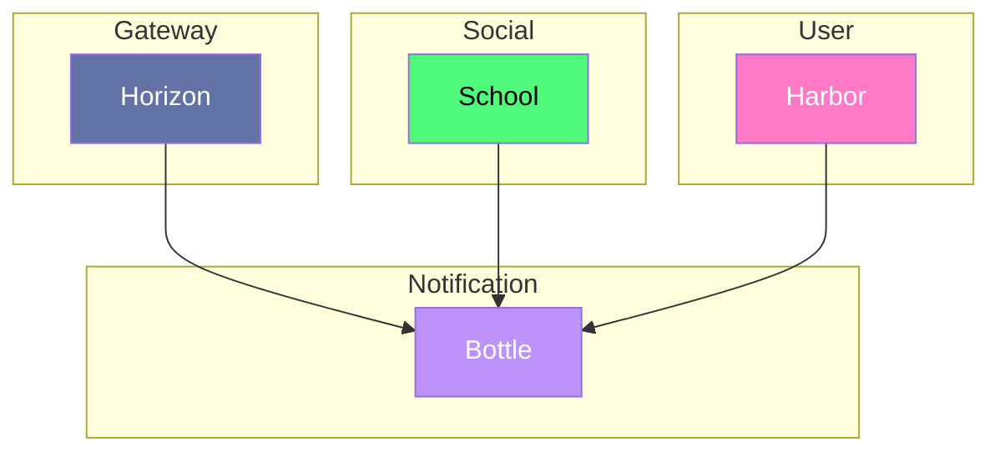

# Bottle

---

Service de notification, il permettra d'envoyer des notifications aux utilisateurs.

## Interaction

> [!NOTE]
> **Horizon** appelle **Bottle** pour la création de notifications.
> **School** appelle **Bottle** pour la création de notification d'avertissement.
> **Harbor** appelle **Bottle** pour la création de notification lié à un utilisateur.

## Composition

- **Database:** MongoDB
- **Interface:** HTTP
- **External Services:** Brevo

## Technologie

- Duplo