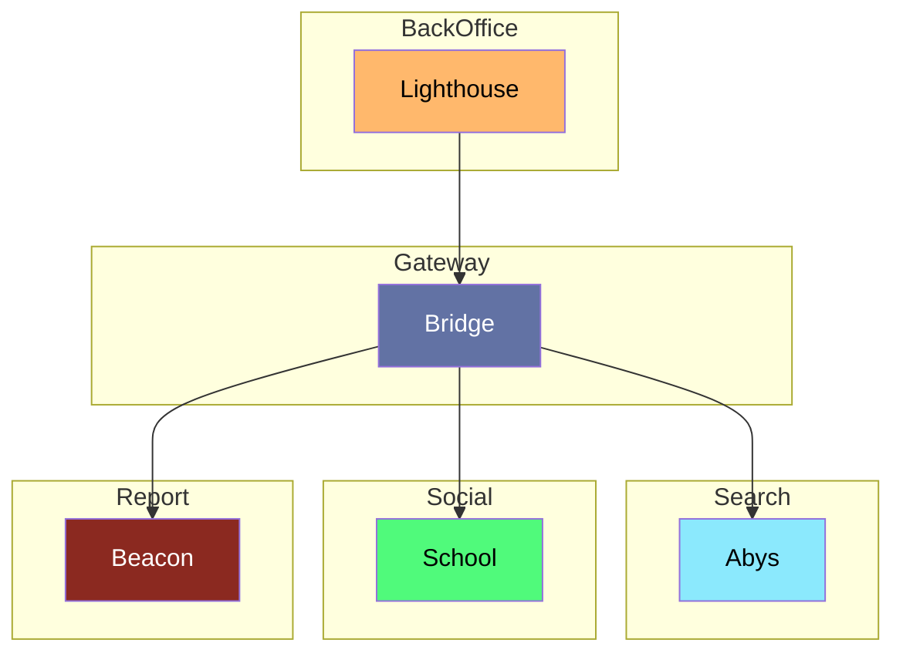

# Bridge

---

API Gateway pour le BackOffice. Il ne peut etre requeter que par le service Lighthouse.

## Interaction

> [!NOTE]
> **Bridge** appelle **Beacon** pour modérer la traduction des documents.
> **Bridge** appelle **School** pour modérer le contenus du forum.
> **Bridge** appelle **Abys** pour re-cuire un document.

## Composition

- **Interfaces:** HTTP

## Technologie

- Duplo