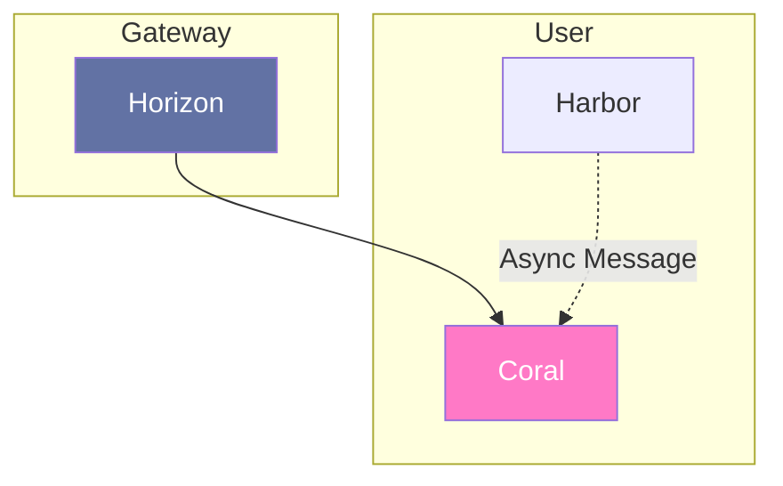

# Coral

---

Service de gestion de données utilisateur. Il permettra de stocker les données utilisateur et de les gérer.

## Interaction

> [!NOTE]
> **Horizon** appelle **Coral** pour permettre aux utilisateurs d'acceder à leurs données\
> **Coral** est abonnée au flux de delete d'un utilisateur

## Composition

- **Databases:** MongoDB
- **Interfaces:** HTTP

## Technologie

- Duplo