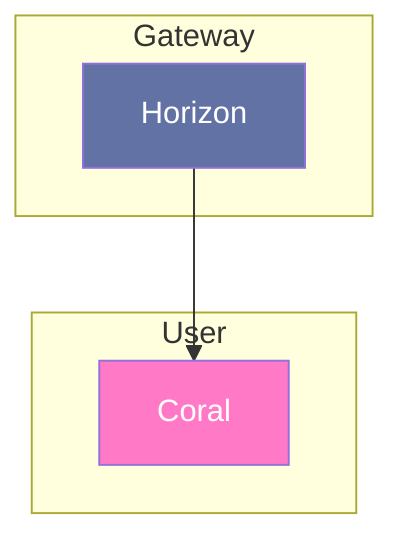

# Coral

## Interaction

```mermaid
flowchart TB
    subgraph Gateway
        Horizon[Horizon]
    end

    subgraph User
		Coral[Coral]
    end

	Horizon --> Coral
	
    classDef gateway fill:#6272a4,color:white
    classDef auth fill:#ff79c6,color:white

    class Horizon gateway
    class Coral auth
```

> [!NOTE]
> **Horizon** appelle **Coral** pour permettre aux utilisateurs d'acceder à leurs données

## Composition

- **Databases:** MongoDB
- **Interfaces:** HTTP