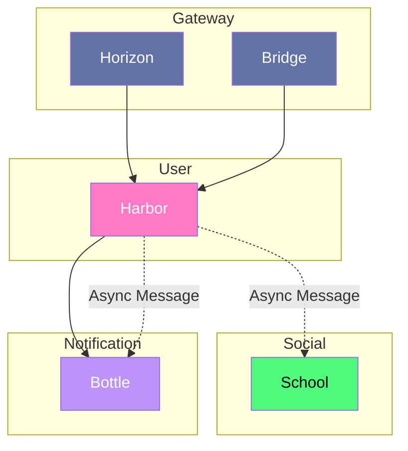

# Harbor

## Interaction

> [!NOTE]
> **Horizon** appelle **Harbor** pour authentifier les utilisateurs
> **Bridge** appelle **Harbor** pour admistrer les utilisateurs
> **Harbor** appelle **Bottle** pour envoyer des notifications
> **Harbor** créer un flux de création d'utilsateur 
> **Harbor** créer un flux de modification d'utilisateur

## Composition

- **Databases**: Postgres
- **Interfaces:** HTTP
- **External Services:** Firebase