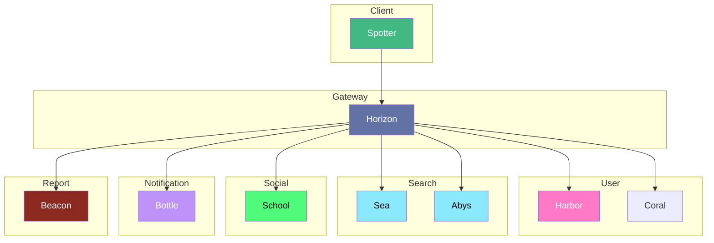

# Horizon

## Interaction

```mermaid
flowchart TB
    subgraph Client
        Spotter[Spotter]
    end

    subgraph Gateway
        Horizon[Horizon]
    end

    subgraph User
        Harbor[Harbor]
		Coral[Coral]
    end

    subgraph Search
        Sea[Sea]
        Abys[Abys]
    end

    subgraph Social
        School[School]
    end

    subgraph Notification
        Bottle[Bottle]
    end

	subgraph Report
		Beacon[Beacon]
	end

    %% Connexions Client
    Spotter --> Horizon

    %% Connexions Gateway
    Horizon --> Harbor
    Horizon --> Sea
    Horizon --> Abys
    Horizon --> School
    Horizon --> Bottle
	Horizon --> Coral
	Horizon --> Beacon
	
    %% Styles
    classDef frontend fill:#42b883,color:white
    classDef gateway fill:#6272a4,color:white
    classDef auth fill:#ff79c6,color:white
    classDef search fill:#8be9fd,color:black
    classDef social fill:#50fa7b,color:black
    classDef bo fill:#ffb86c,color:black
    classDef notification fill:#bd93f9,color:white
	classDef report fill:#8B2920,color:white

    %% Application des styles
    class Spotter frontend
    class Horizon gateway
    class Harbor auth
    class Sea,Abys,MarineSnow,Rosetta,Beacon search
    class School social
    class Bottle notification
	class Beacon report
```

## Composition

- **Interfaces:** HTTP