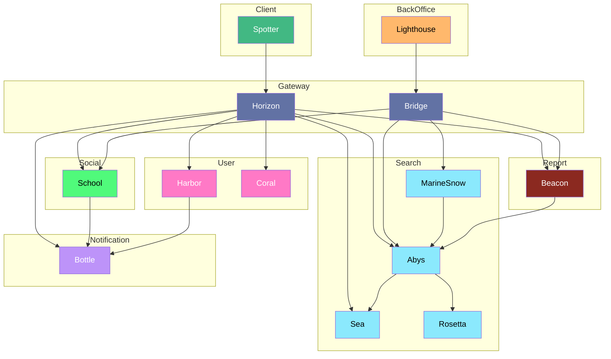
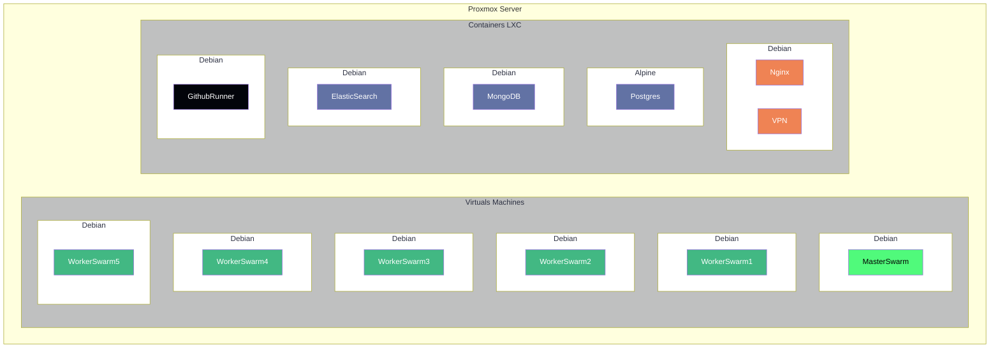
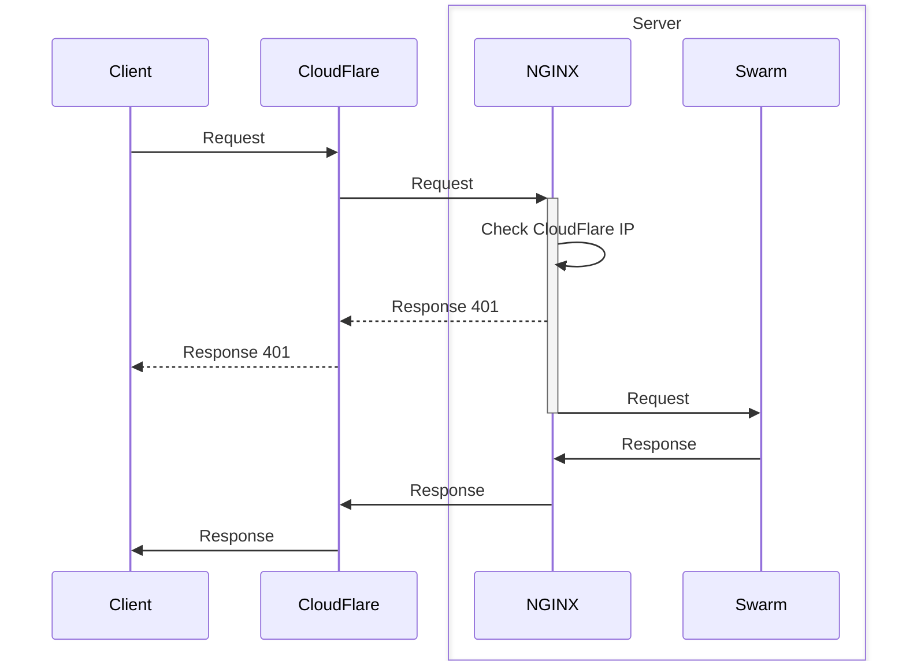

# Infrastructure

---

## Sommaire des services

---

- [Abys](abys/schema.md)
- [Beacon](beacon/schema.md)
- [Bottle](bottle/schema.md)
- [Bridge](bridge/schema.md)
- [Coral](coral/schema.md)
- [Harbor](harbor/schema.md)
- [Horizon](horizon/schema.md)
- [Lighthouse](lighthouse/schema.md)
- [MarineSnow](marine-snow/schema.md)
- [Rosetta](rosetta/schema.md)
- [School](school/schema.md)
- [Sea](sea/schema.md)
- [Spotter](spotter/schema.md)

## Schéma micro-service

---

## Schéma système

---

## Schéma système externe

