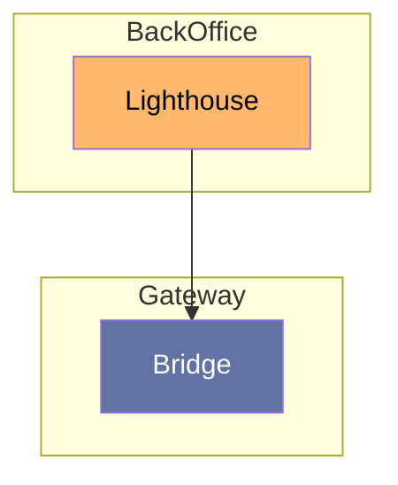

# Lighthouse

## Interaction

```mermaid
flowchart TB
    subgraph Gateway
        Bridge[Bridge]
    end

    subgraph BackOffice
        Lighthouse[Lighthouse]
    end

    Lighthouse --> Bridge
	
    classDef gateway fill:#6272a4,color:white
    classDef bo fill:#ffb86c,color:black

    class Bridge gateway
    class Lighthouse bo
```

> [!NOTE]
> **Lighthouse** adminstre le contenu à travers **Bridge**

## Composition

- **Interfaces:** HTTP