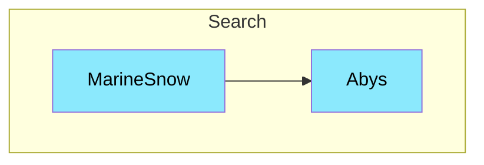

# Marine-Snow

---

Service de scrapping de donnée. Il permettra de récupérer des données sur le web et de les stocker dans Abys. Il sera capable de scrappé des sites web comme Pubmed, Pedro ou encore ScienceDirect. L'objetif est de faire en sorte que MarineSnow Puisse controller des mini sous service slave dans les thread worker qui seront capable de scrappé des sites web. Il faut faire en sorte qu'il soit le plus générique pour être adapté à n'importe quel site web.

## Interaction

> [!NOTE]
> **Marine-Snow** appelle **Abys** pour créer enregistrer les documents précédement crawler

## Composition

- **Databases**: Postgres
- **Interfaces:** HTTP

## Technologie

- Duplo