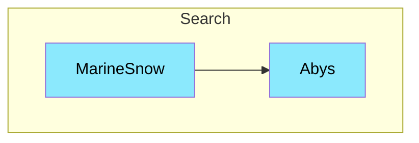

# Marine-Snow

## Interaction

> [!NOTE]
> **Marine-Snow** appelle **Abys** pour créer enregistrer les documents précédement crawler

## Composition

- **Databases**: Postgres
- **Interfaces:** HTTP
