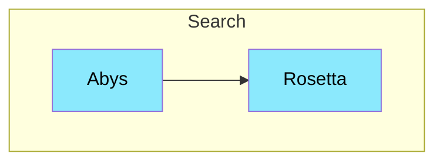

# Rosetta

---

Service de traduction, il permettra de traduire les documents dans différentes langues.

## Interaction

> [!NOTE]
> **Abys** appelle **Rosetta** pour traduire ces documents

## Composition

- **Interfaces:** HTTP
- **Inrernal Service:** Libretranslate
- **External Service:** Google translate

## Technologie

- Duplo