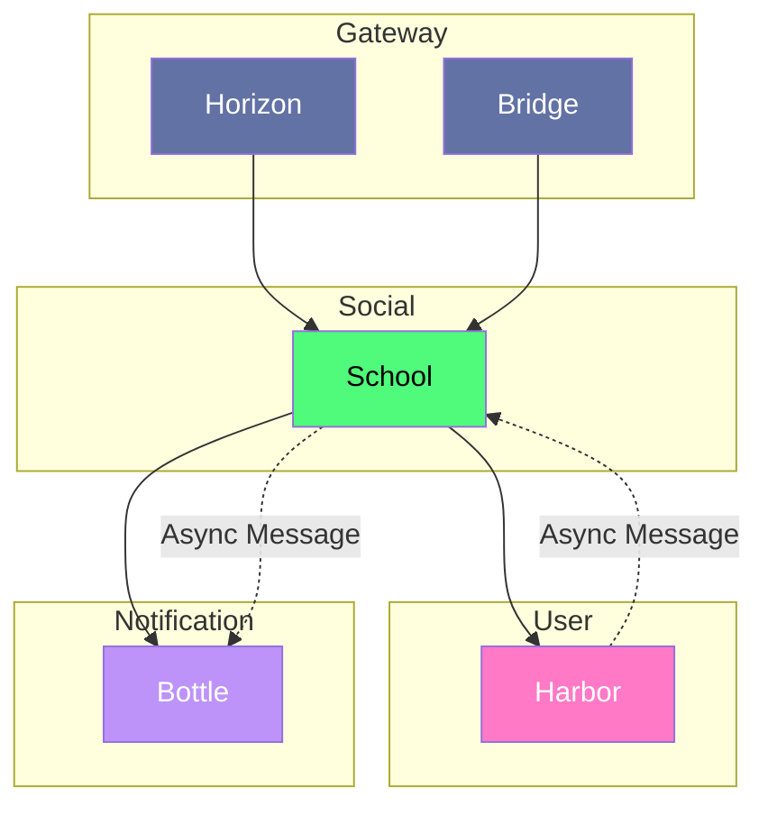

# School

## Interaction

> [!NOTE]
> **Horizon** appelle **School** pour accéder aux contenus des forums
> **School** appelle **Bottle** pour envoyer des notifications
> **School** appelle **Harbor** pour mettre des avertissements aux utilisateurs pour leurs contenus
> **Bridge** appelle **School** pour administrer le contenu
> **School** est abonnée au flux de mise à jour d'un utilisateur
> **School** Émet un flux de création de contenu

## Composition

- **Database:** MongoDB
- **Interface:** HTTP