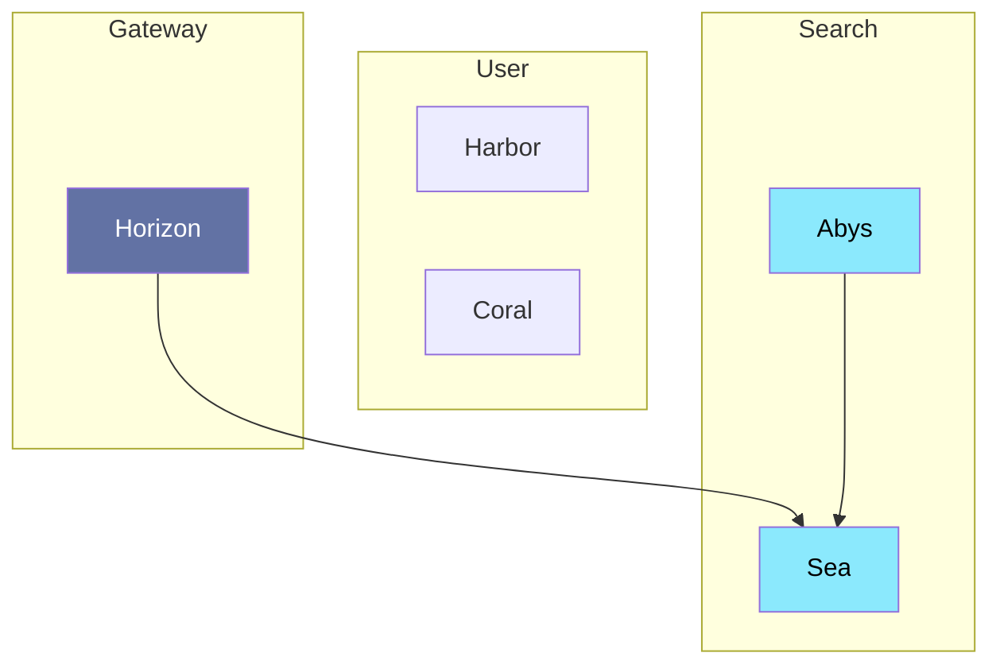

# Sea

---

Le service ElasticSearch permettra d'indexer les documents avec un certains poids. Il permettra de faire des recherches avancées et de trouver des documents similaires.

## Interaction

> [!NOTE]
> **Abys** appelle **Sea** pour indexer des documents
> **Horizon** appelle **Sea** pour chercher des documents

## Composition

- **Databases:** EslacticSearch
- **Interfaces:** HTTP

## Technologie

- Duplo