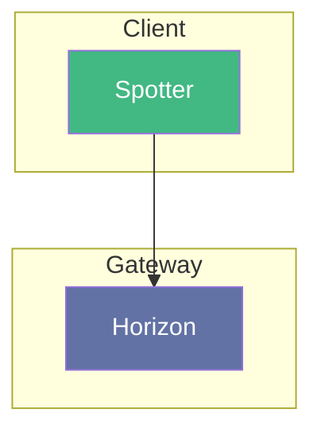

# Spotter

---

Application web client permettant de rechercher des articles, de les lire, de les commenter et de les sauvegarder dans les listes.

## Interaction

> [!NOTE]
> **Horizon** est la porte d'entrée sécurisée de **Spotter**

## Composition

- **Interfaces:** HTTP

## Technologies

- **Vue**