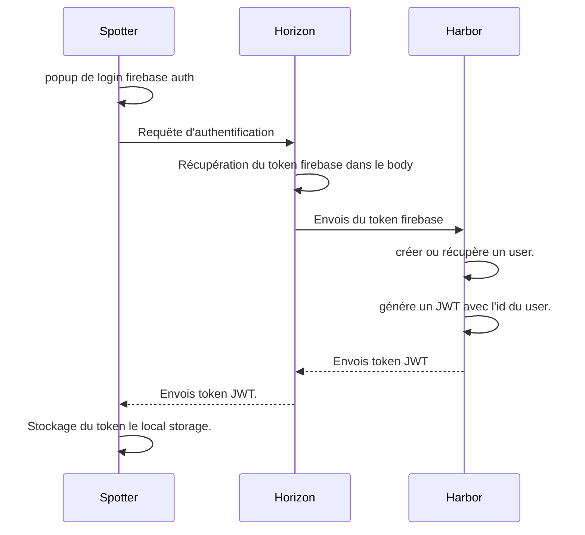

# Diagramme de séquence Spotter

Ce diagramme de séquence schématise la communication entre les différents micro-services nécessaire à l'authentification d'un utilisateur afin d'en comprendre son fonctionnement.

